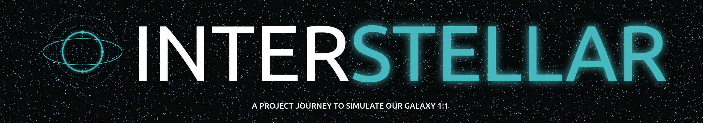
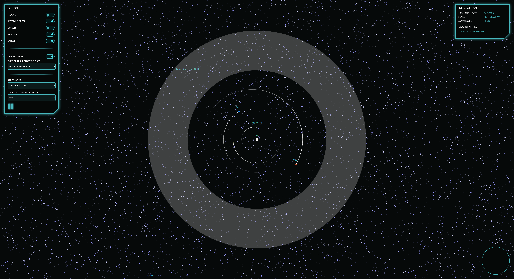

# interstellar



[](http://commitizen.github.io/cz-cli/)
[](http://makeapullrequest.com)
[](http://semver.org/spec/v2.0.0.html)


## About

> A project journey to simulate our galaxy 1:1

Interstellar is a small project I dabble with from time to time between clients.
The goal is to ultimately have a 1:1 simulation of our galaxy and to be able to
view information and follow all known celestial bodies, including calculating
trajectories of asteroids.

### Timeline

- [x] **First version** is to establish a 2d space for celestial bodies and UI
- [ ] **Second version** is to convert to 3d space
- [ ] **Third version** is to use web workers in some extent
- [ ] **Fourth version** is to draw this with WebGL

## Table of Contents<!-- omit from toc -->

- [interstellar](#interstellar)
  - [About](#about)
    - [Timeline](#timeline)
  - [Known issues](#known-issues)
  - [API](#api)
  - [Development](#development)
  - [Contributing](#contributing)
  - [License](#license)
  - [Changelog](#changelog)
  - [Sponsor me](#sponsor-me)



## Known issues

- Orbits are a bit wrong when zooming in too much.
- Initial positions of the celestial bodies are off
- Orbits of comets are not working
- Not accounting for any counter clockwise rotation of celestial bodies

## API

Full API documentation is available
[here](https://github.com/phun-ky/interstellar/blob/main/api/README.md).

## Development

```
// Build
$ npm run build
// Run dev
$ npm run dev
// Test
$ npm test
```

## Contributing

Want to contribute? Please read the
[CONTRIBUTING.md](https://github.com/phun-ky/interstellar/blob/main/CONTRIBUTING.md)
and
[CODE_OF_CONDUCT.md](https://github.com/phun-ky/interstellar/blob/main/CODE_OF_CONDUCT.md)

## License

This project is licensed under a
[GPL-3.0 License](https://choosealicense.com/licenses/gpl-3.0/). - see the
[LICENSE](https://github.com/phun-ky/interstellar/blob/main/LICENSE) file for
details.

## Changelog

See the
[CHANGELOG.md](https://github.com/phun-ky/interstellar/blob/main/CHANGELOG.md)
for details on the latest updates.

## Sponsor me

I'm an Open Source evangelist, creating stuff that does not exist yet to help
get rid of secondary activities and to enhance systems already in place, be it
documentation or web sites.

The sponsorship is an unique opportunity to alleviate more hours for me to
maintain my projects, create new ones and contribute to the large community
we're all part of :)

[Support me on GitHub Sponsors](https://github.com/sponsors/phun-ky).

---

p.s. **Ukraine is still under brutal Russian invasion. A lot of Ukrainian people
are hurt, without shelter and need help**. You can help in various ways, for
instance, directly helping refugees, spreading awareness, putting pressure on
your local government or companies. You can also support Ukraine by donating
e.g. to [Red Cross](https://www.icrc.org/en/donate/ukraine),
[Ukraine humanitarian organisation](https://savelife.in.ua/en/donate-en/#donate-army-card-weekly)
or
[donate Ambulances for Ukraine](https://www.gofundme.com/f/help-to-save-the-lives-of-civilians-in-a-war-zone).
